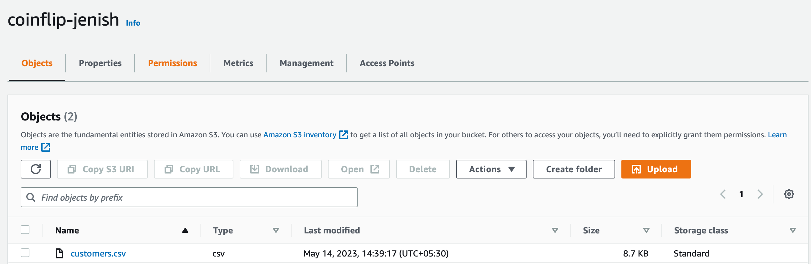
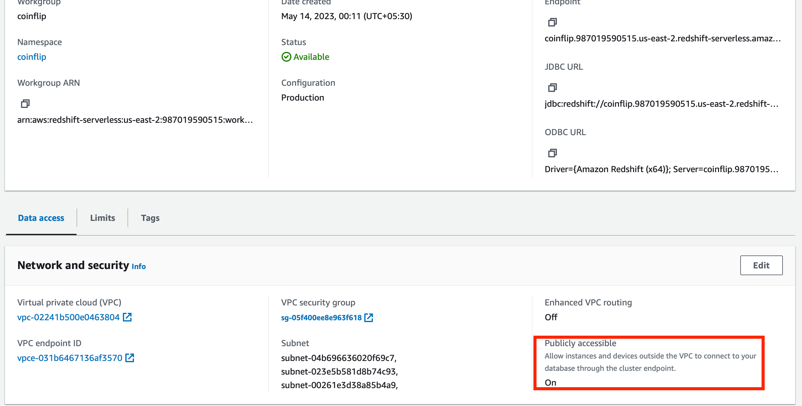

# Data Pipeline Architecture
* I have actually drawn the diagram because I wasn't aware of the tools to design the pipeline architecture. It is a simple diagram based on what I have understood from the assessment.

* Extraction phase - The customers csv data is stored in AWS S3 bucket which is highly scalable and efficient mode of storage able to retrieve large amount of data quickly. The transactions json data is stored in azure blob storage. The Blob storage is mainly used for storing unstructured data including json.
* The data is extracted using python libraries and converted to two pandas dataframes. They are then merged into one, cleansed and formatted appropriately.
* We then load this data to aws redshift. To do this, we take the help of AWS Glue which allows us to integrate and move data from various sources quickly and efficiently especially when the data size is large. AWS Redshift is a serverless data warehouse used to analyze structured and semi-structured data. In AWS Redshift, the data rests as SQL data in a workgroup database.

# Instructions on how to set up and run the lab
1. Create a folder with main.py, customers.csv, transactions.json and requirements.txt
2. Create a virtual environment using the requirements.txt dependencies in any python editor you are using. I used Pycharm and created a virtual environment in this same folder.
3. Please note: I have added sections (as comments) in the main.py code so I will be referring to those sections here
4. (Optional) Section A is not required to be performed. It is creation of dummy data according to the attributes mentioned in the assignment. The final csv and json files are created after running the Section A which are added to this github repo. Note: I had also created missing values (which is not mentioned in the code) in the data to test missing values part in the tranformation phase later. Hence I have commented the Section A as you can directly used the csv and json files attached.
5. Before running Section B, let's upload the csv file in AWS S3 and json file in Azure Blob Storage so that we can work on the Data pipeline.
    1. Open aws console, create a S3 bucket with default configuration 
   
    2. Add the customers.csv file as an object to this bucket.
   
    3. Open Azure portal, then goto storage account and create a new one with default settings.
   
    4. Create a container, and upload the transactions.json file to it.
   
6. From here, we can start working on the actual ETL pipeline. Steps 7 to 23 are a walkthrough which includes how to get the credential values for the entire python code.
7. For Section B, create an access key id from AWS. Click on your name at the top right and select security credentials. From there, you can create an access key. 

8. The aws_bucket and aws_file_name can be obtained from the aws console where you uploaded the csv file in the previous steps.
9. In Section C, to obtain the connection string, goto storage account -> access keys from the left navigation menu.

10. The azure_container_name and azure_file_name can be obtained from the azure portal in the storage account where you uploaded the json file in the previous steps.
11. Section D requires no additional steps.
12. Goto aws redshift serverless from the console and click on create workgroup. You can create a new namespace for the workgroup and choose the username and password which will be used later. Keep the rest of the fields default.

13. Navigate inside the workgroup, under data access, edit the publicly accessible to "On".

14. Now go to VPC dashboard in the aws console. From the left navigation bar, click on security groups. Go to the inbound rules section of the security group associated with the redshift workgroup. Make sure that the rules match with the screenshot provided below.

15. Inside the VPC dashboard, go to route tables and edit the routes according to the screenshot provided below.

16. Navigate back to redshift and click on query data. A new window will open where you will be able to see the workgroup you defined before. Click on it and create connection using the username and password you chose while creating the workgroup.

17. Once the connection is established, you will be able to create tables from the python script.
18. (Optional) Section E is not required, I had implemented SQL queries to create tables and load/retrieve data to/from redshift. However, this method is slower because it does not implement AWS Glue. In this section, the username and password are the ones used while creating the workgroup. Host is the url which can be found by navifating to the workgroup and copying the endpoint as shown in the image below. Port is 5439 and database is dev by default.

19. Note: In section E, I had created a dummy table "shoes" (for testing). If the query is a simple data retrieval, then you do not need to enter con.commit() command. However, for creating or altering entries in the data, you will need to commit.
20. Let's now create AWS Glue connection for Section F.
21. Goto AWS Glue Page. From the right navigation click on connections. Then click on create connection.
22. For the connection type, select JDBC. The JDBC URL can be obtained from the screenshot after point 18. Mention the same user and password credentials you used for redshift.

23. Mention the region name in the python code which appears in your AWS account in Redshift. You can see this at the top right of the screen. The connection parameter is the name of the connection for the AWS Glue you just created.
24. Finally, run the entire python file using the command - python main.py
25. Below is the output screenshot:

